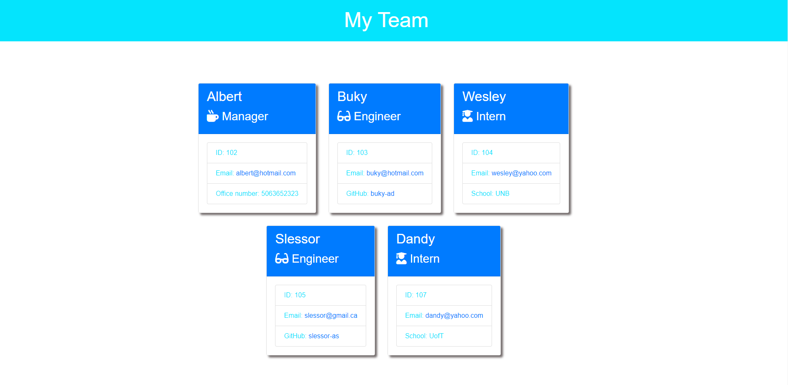

# Team-Profile-Generator

## Description
A Node.js command-line application that takes in information about members of a team and generates an HTML webpage that displays summaries for each person. Unit tests are also provided for the classes in the application.

## Table of Contents

* [Installation](#installation)
* [Usage](#usage)
* [License](#license)
* [URLs](#urls)
* [Tests](#tests)
* [Questions](#questions)

## Installation

Fork, download or clone the repository from Github. The application also requires the file system and inquirer modules to be installed. To use the test files, jest needs to be installed.

## Usage

Start the application from your terminal using the command : node index.js. Below is the sample page generated once application exits.

## License

This project is licensed under the MIT License.

## URLs

The walkthrough video can be found [here](https://youtube.com/watch?v=EmqZHZC23E4&si=EnSIkaIECMiOmarE) .

The URL of the GitHub repository containing the code is: https://github.com/Buky-js/Team-Profile-Generator

## Tests

Install Jest module to run the tests on the classes.

## Questions
If you have any questions about this project, please contact me directly at bukyabiona@gmail.com.

